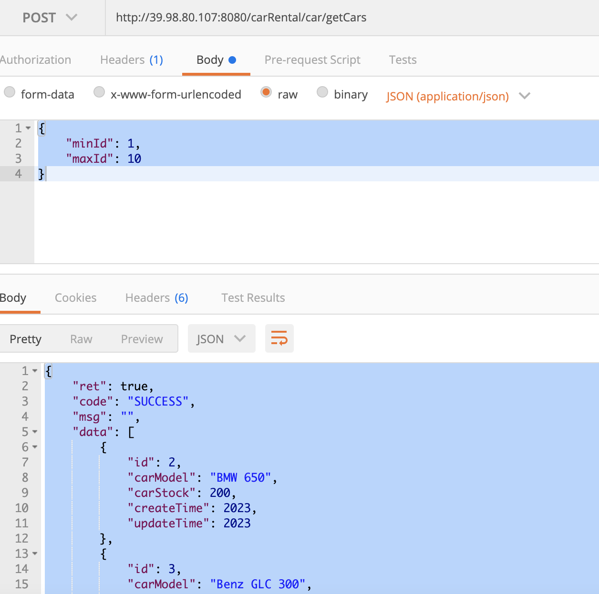
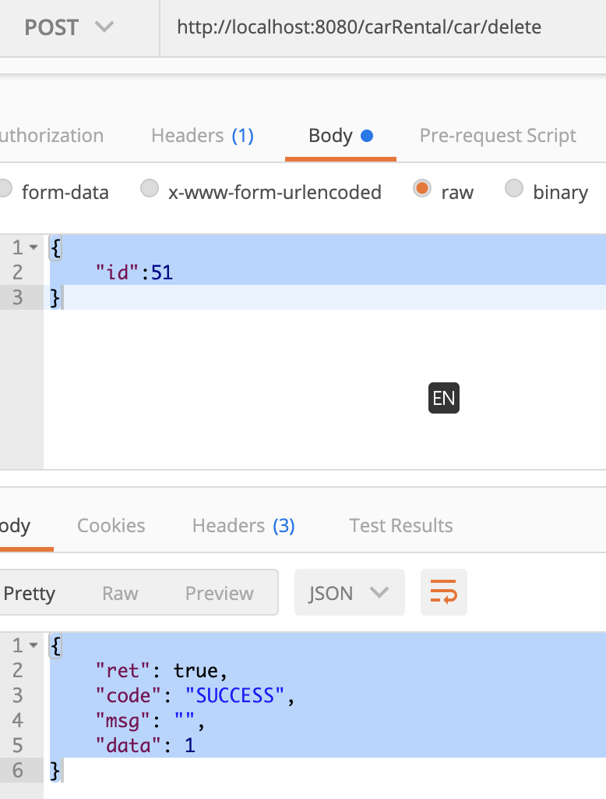
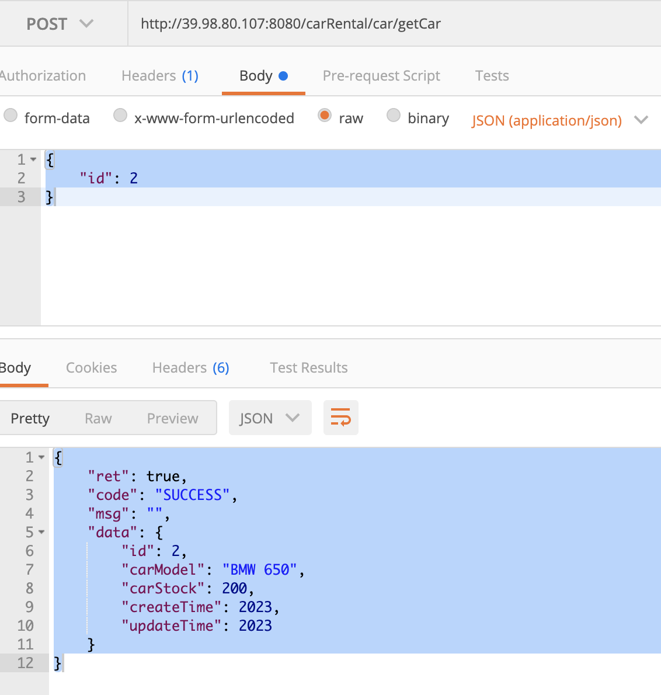
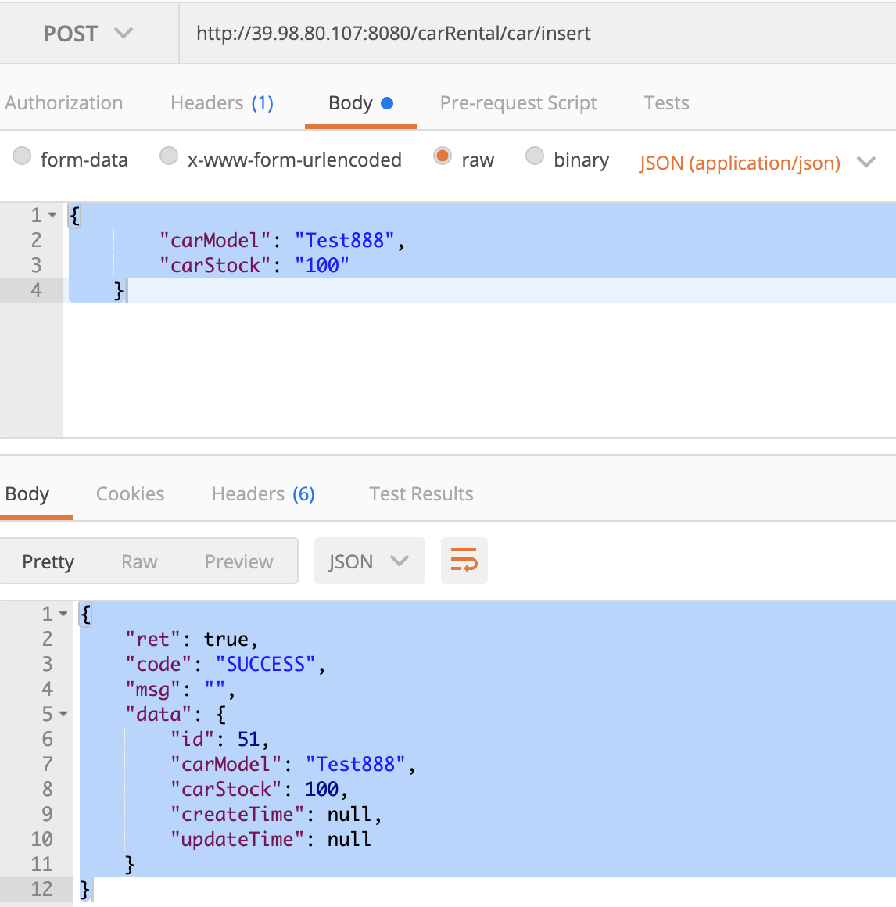
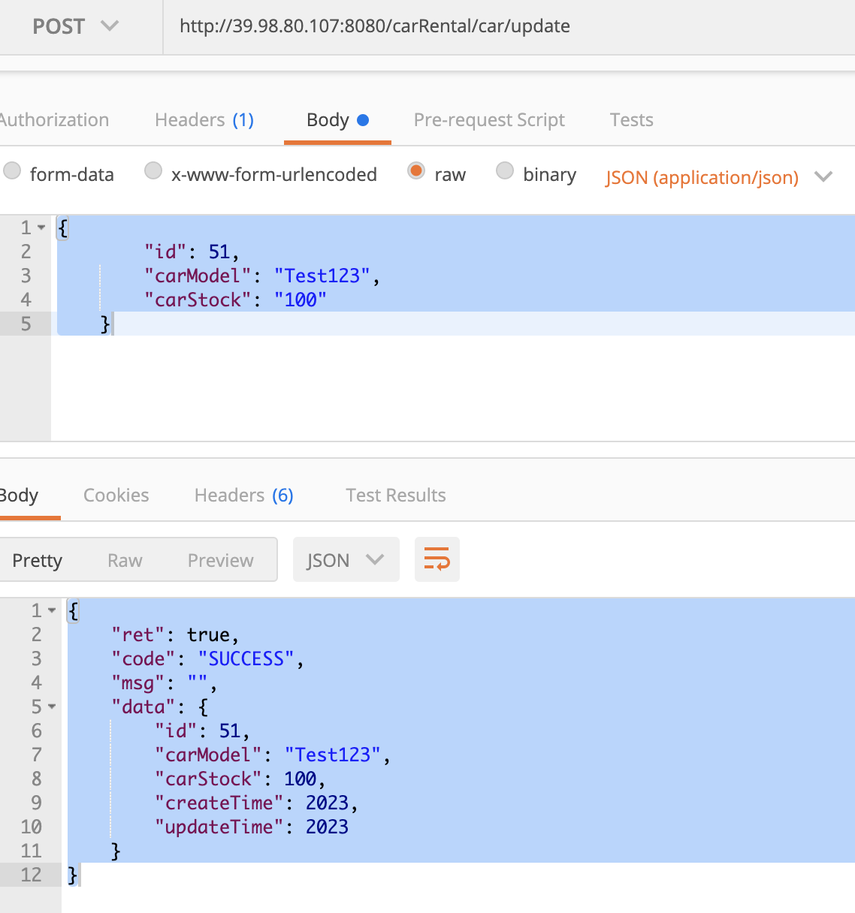
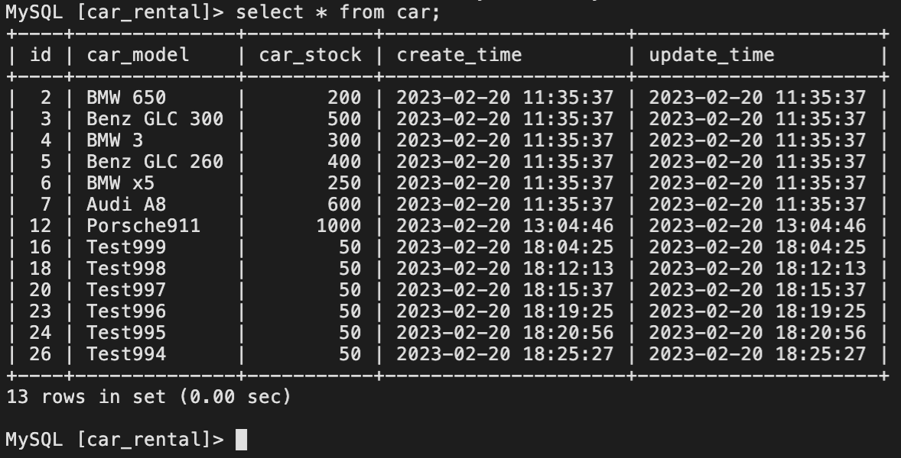
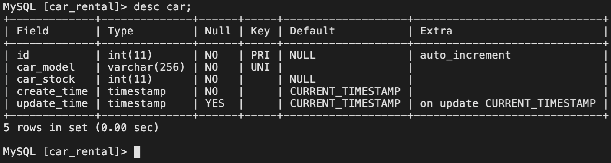
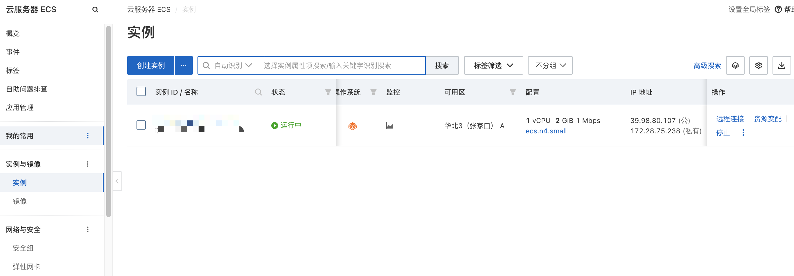

# springboot-rest-h2-swagger

This is an example of Spring Boot + JPA + Rest + H2 + Swagger

This project is built as an example for any one to would like to have a base to start

1. Spring Boot
2. JPA
3. Rest Controller
4. H2
5. Swagger
6. mybatis
7. mysql
8. junit unit test

# Test Cases

Rest请求入口:
CarRentalController

# Get Api example

Get car Request:  POST METHOD
http://39.98.80.107:8080/carRental/car/getCar

Request Body:
{
"id": 2
}

Response Body:
{
"ret": true,
"code": "SUCCESS",
"msg": "",
"data": {
"id": 2,
"carModel": "BMW 650",
"carStock": 200,
"createTime": 2023,
"updateTime": 2023
}
}

batch get cars Request: POST METHOD
http://39.98.80.107:8080/carRental/car/getCars

Request Body:
{
"minId": 1,
"maxId": 10
}

Response Body:
{
"ret": true,
"code": "SUCCESS",
"msg": "",
"data": [
{
"id": 2,
"carModel": "BMW 650",
"carStock": 200,
"createTime": 2023,
"updateTime": 2023
},
{
"id": 3,
"carModel": "Benz GLC 300",
"carStock": 500,
"createTime": 2023,
"updateTime": 2023
},
{
"id": 4,
"carModel": "BMW 3",
"carStock": 300,
"createTime": 2023,
"updateTime": 2023
},
{
"id": 5,
"carModel": "Benz GLC 260",
"carStock": 400,
"createTime": 2023,
"updateTime": 2023
},
{
"id": 6,
"carModel": "BMW x5",
"carStock": 250,
"createTime": 2023,
"updateTime": 2023
},
{
"id": 7,
"carModel": "Audi A8",
"carStock": 600,
"createTime": 2023,
"updateTime": 2023
}
]
}

# Add Car

Request: Post Method
http://39.98.80.107:8080/carRental/car/insert

Request Body:
{
"carModel": "Test888",
"carStock": "100"
}

Response Body:
{
"ret": true,
"code": "SUCCESS",
"msg": "",
"data": {
"id": 51,
"carModel": "Test888",
"carStock": 100,
"createTime": null,
"updateTime": null
}
}

# Update Car

Request: Post Method
http://39.98.80.107:8080/carRental/car/update

Request Body:
{
"id": 51,
"carModel": "Test123",
"carStock": "100"
}

Response Body:
{
"ret": true,
"code": "SUCCESS",
"msg": "",
"data": {
"id": 51,
"carModel": "Test123",
"carStock": 100,
"createTime": 2023,
"updateTime": 2023
}
}

# delete car

Request: POST Method
http://39.98.80.107:8080/carRental/car/delete

Request Body:
{
"id":51
}

Response Body:
{
"ret": true,
"code": "SUCCESS",
"msg": "",
"data": 1
}

# Swagger UI URL

http://39.98.80.107:8080/carRental/swagger-ui.html

# Web Portal Client Demo

http://39.98.80.107:8080/carRental/index.html

# 图片示例

# mysql

# Aliyun Instance

